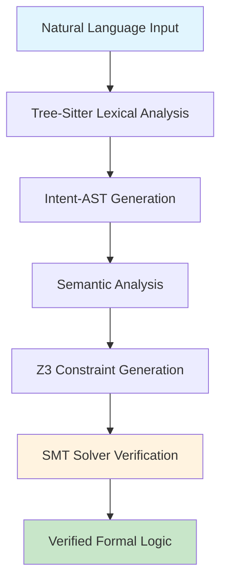
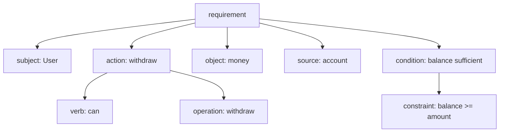
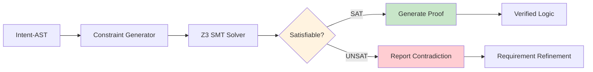
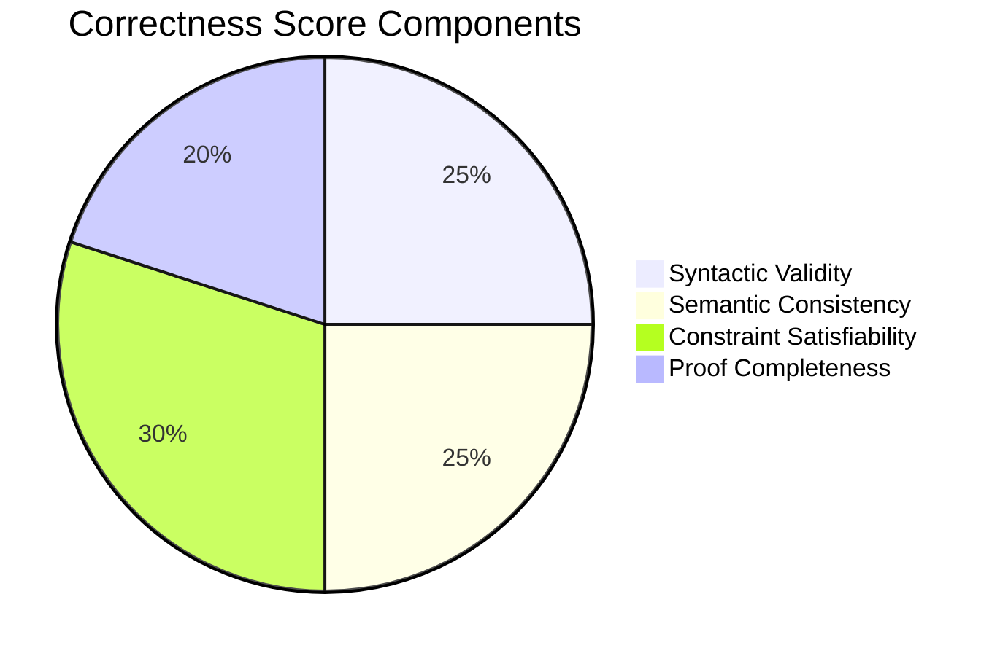
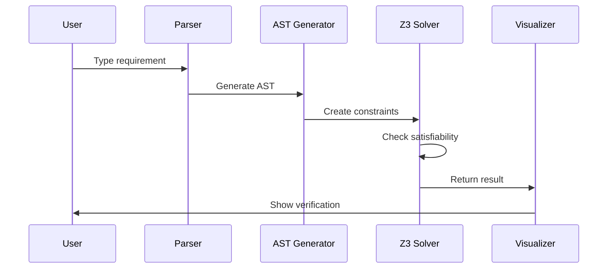

# Parser Logic Visualization
## "From Natural Language to Formal Logic"

### 🎯 The Transformation Pipeline

Crucible Engine transforms natural language requirements into mathematically verified formal logic through a multi-stage parsing pipeline.

## 📊 Visual Pipeline Overview



## 🔍 Example Transformation

### Input: Natural Language Requirement
```
"User can withdraw money from account if balance is sufficient"
```

### Stage 1: Tree-Sitter Parse Tree


### Stage 2: Intent-AST Structure
```json
{
  "type": "requirement",
  "subject": "User",
  "action": {
    "verb": "can",
    "operation": "withdraw",
    "object": "money"
  },
  "constraints": [
    {
      "type": "precondition",
      "expression": "balance >= amount",
      "variables": ["balance", "amount"]
    }
  ],
  "invariants": [
    {
      "type": "safety",
      "expression": "balance >= 0"
    }
  ]
}
```

### Stage 3: Z3 SMT Constraints
```smt2
; Declare variables
(declare-const balance Int)
(declare-const amount Int)
(declare-const balance_after Int)

; Preconditions
(assert (>= balance 0))        ; Account balance is non-negative
(assert (> amount 0))          ; Withdrawal amount is positive
(assert (>= balance amount))   ; Sufficient funds

; Operation
(assert (= balance_after (- balance amount)))

; Postconditions
(assert (>= balance_after 0))  ; Balance remains non-negative

; Check satisfiability
(check-sat)
(get-model)
```

### Stage 4: Verification Result
```
sat
(model
  (define-fun balance () Int 100)
  (define-fun amount () Int 50)
  (define-fun balance_after () Int 50)
)
```

## 🌳 Tree-Sitter Grammar Preview

### Natural Language Requirements Grammar
```javascript
module.exports = grammar({
  name: 'requirements',
  
  rules: {
    requirement: $ => seq(
      $.subject,
      $.modal_verb,
      $.action,
      optional($.condition)
    ),
    
    subject: $ => choice(
      'User',
      'System',
      'Admin'
    ),
    
    modal_verb: $ => choice(
      'can',
      'must',
      'should',
      'shall'
    ),
    
    action: $ => seq(
      $.verb,
      $.object,
      optional($.preposition_phrase)
    ),
    
    condition: $ => seq(
      'if',
      $.constraint_expression
    ),
    
    constraint_expression: $ => choice(
      $.comparison,
      $.logical_expression
    )
  }
});
```

## 🧮 Z3 Integration Architecture



## 📈 Correctness Scoring Algorithm

### Scoring Metrics


### Scoring Formula
```
Correctness Score = (
    0.25 * syntactic_score +
    0.25 * semantic_score +
    0.30 * satisfiability_score +
    0.20 * proof_score
) * 100
```

## 🎯 Real-Time Parsing Flow



## 🔮 Future Enhancements

### Multi-Language Support
- English (current)
- Spanish requirements
- Technical specifications
- Legal constraints

### Advanced Verification
- Temporal logic (LTL/CTL)
- Probabilistic constraints
- Resource bounds
- Security properties

### Code Generation Preview
```rust
// Generated from verified requirements
#[verified(precondition = "balance >= amount")]
#[verified(postcondition = "balance' = balance - amount")]
pub fn withdraw(account: &mut Account, amount: u64) -> Result<(), WithdrawError> {
    if account.balance < amount {
        return Err(WithdrawError::InsufficientFunds);
    }
    account.balance -= amount;
    Ok(())
}
```

---

**"Every natural language requirement becomes mathematically verified formal logic."**

*This visualization demonstrates the core transformation that makes Crucible Engine unique: turning "vibes" into verified mathematics.*